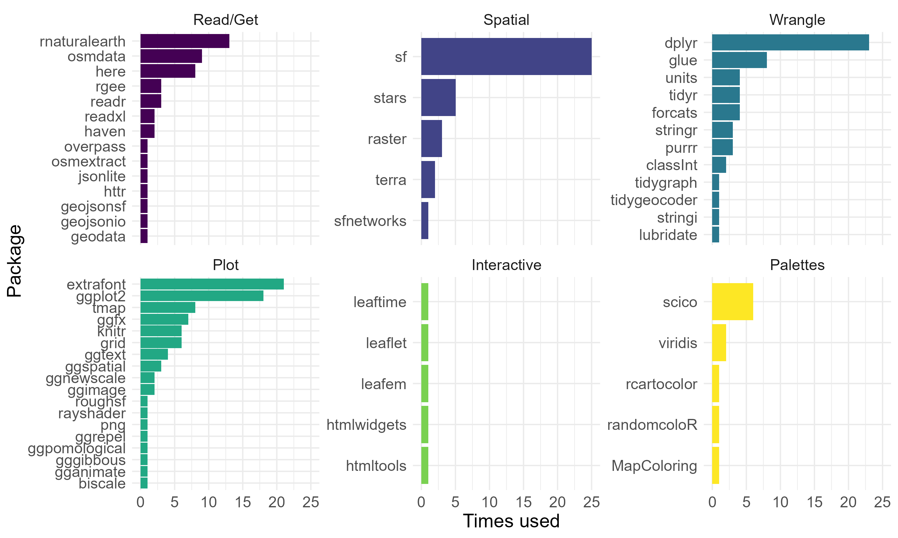

```{r setup, include=FALSE}
knitr::opts_chunk$set(echo = FALSE)
library(tidyverse)
library(gt)
```

# The challenge
Since 2019, the [#30DayMapChallenge](https://github.com/tjukanovt/30DayMapChallenge) by [Topi Tjukanov](https://twitter.com/tjukanov) has brought map geeks together for a month to flood our Twitter feeds with mind-blowing maps. 

This year, I decided to participate by making maps with R! I had a lot of fun, but it was also quite a journey. I chose as an overarching topic my home country: **Ecuador**. I posted each of the maps on [Twitter](https://twitter.com/loreabad6), and these two are the ones that received most attention:

<center>
<blockquote class="twitter-tweet"><p lang="en" dir="ltr"><a href="https://twitter.com/hashtag/30DayMapChallenge?src=hash&amp;ref_src=twsrc%5Etfw">#30DayMapChallenge</a> <br>Day 10: Raster<br>I am usually asked how hot my country is, and I usually say, not as hot as you may think! <br>Worldclim data is a wonderful source for <a href="https://twitter.com/hashtag/dataviz?src=hash&amp;ref_src=twsrc%5Etfw">#dataviz</a><a href="https://twitter.com/hashtag/RStats?src=hash&amp;ref_src=twsrc%5Etfw">#RStats</a> <a href="https://twitter.com/hashtag/rspatial?src=hash&amp;ref_src=twsrc%5Etfw">#rspatial</a> <a href="https://t.co/Fgurk6du09">pic.twitter.com/Fgurk6du09</a></p>&mdash; Lorena Abad (@loreabad6) <a href="https://twitter.com/loreabad6/status/1458747576455475210?ref_src=twsrc%5Etfw">November 11, 2021</a></blockquote> <script async src="https://platform.twitter.com/widgets.js" charset="utf-8"></script>

<blockquote class="twitter-tweet"><p lang="en" dir="ltr"><a href="https://twitter.com/hashtag/30DayMapChallenge?src=hash&amp;ref_src=twsrc%5Etfw">#30DayMapChallenge</a> <br>Day 24: Historical<br><br>Humboldt&#39;s travels through the Americas<br>I have been fascinated with this scientist and since I read The Invention of Nature by <a href="https://twitter.com/andrea_wulf?ref_src=twsrc%5Etfw">@andrea_wulf</a> I wanted to learn more and more!<a href="https://twitter.com/hashtag/RStats?src=hash&amp;ref_src=twsrc%5Etfw">#RStats</a> <a href="https://twitter.com/hashtag/RSpatial?src=hash&amp;ref_src=twsrc%5Etfw">#RSpatial</a> <a href="https://t.co/J5yPUqZtFY">pic.twitter.com/J5yPUqZtFY</a></p>&mdash; Lorena Abad (@loreabad6) <a href="https://twitter.com/loreabad6/status/1463564916187619333?ref_src=twsrc%5Etfw">November 24, 2021</a></blockquote> <script async src="https://platform.twitter.com/widgets.js" charset="utf-8"></script>
</center>

My personal favorite, however, is day 13. I live away from home and so many other Ecuadorians do. It was amazing to see where we all are, and how "far-away" time wise each of us is from calling our loved ones.  

<center>
<blockquote class="twitter-tweet"><p lang="en" dir="ltr"><a href="https://twitter.com/hashtag/30DayMapChallenge?src=hash&amp;ref_src=twsrc%5Etfw">#30DayMapChallenge</a> <br>Day 13: NaturalEarth data challenge<br><br>What is a good time to call home? Timezones are a hard thing to get used to when away from home. Here is a helpful map for all those Ecuadorians living abroad. <a href="https://twitter.com/hashtag/RStats?src=hash&amp;ref_src=twsrc%5Etfw">#RStats</a> <a href="https://twitter.com/hashtag/RSpatial?src=hash&amp;ref_src=twsrc%5Etfw">#RSpatial</a> <a href="https://t.co/i54824zsrx">pic.twitter.com/i54824zsrx</a></p>&mdash; Lorena Abad (@loreabad6) <a href="https://twitter.com/loreabad6/status/1460351905444544514?ref_src=twsrc%5Etfw">November 15, 2021</a></blockquote> <script async src="https://platform.twitter.com/widgets.js" charset="utf-8"></script>
</center>

You can see my complete gallery on [this GitHub repository](https://github.com/loreabad6/30DayMapChallenge). This post is meant to show the back-end of these maps, so here we go!


# Code-driven maps

I get a certain satisfaction of generating maps with code. To know that a bunch of commands can result in pretty figures is not only rewarding but also helpful. The certainty that I can always go back to a piece of code to re-generate a certain plot is the peak of reproducible data visualization. 

Don't get me wrong, GUIs are great and have many advantages, like not taking 30 minutes to figure out the best coordinates for your labels. But it is that nice feeling of seeing a map somewhere and thinking: *How did this person do that? Which tools/packages did they use? Did they go through crazy workarounds to get that effect?*; and then actually being able to scan the building blocks of that map and answer those questions and test those effects for yourself, **that makes the difference for me**.

Of course, this can only happen when code is shared. I personally love R's capabilities for creating nice maps/figures and I myself used only R for this challenge (except for [Day 15: map without a computer](https://raw.githubusercontent.com/loreabad6/30DayMapChallenge/main/maps/day15.jpg)). 

Many other mappers used R for their challenge as well. Here are some of the GitHub repositories and Gists I found, that used R for their challenge:

[gkaramanis](https://github.com/gkaramanis/30DayMapChallenge)
| [schochastics](https://github.com/schochastics/30DayMapChallenge)
| [shandiya](https://github.com/shandiya/30DayMapChallenge)
| [dakvid](https://gist.github.com/dakvid/)
| [leeolney3](https://github.com/leeolney3/30DayMapChallenge)
| [tashapiro](https://github.com/tashapiro/30DayMapChallenge)
| [bydata](https://github.com/bydata/30DayMapChallenge-2021)

I don't mean this in any way as a comprehensive list, but just a sample of all the creative code out there during this edition of the challenge. For some further examples check [David Frigge's awesome gallery](https://david.frigge.nz/3RDayMapChallenge)!

# Metamapping my challenge

The final day of the challenge is metamapping day. According to the details one can:

> Spend the day either by 1) collecting your entries from the challenge to a common gallery, 2) writing a tutorial or a blog post on one of your maps or 3) create a map from a theme you have chosen yourself

Well, I decided to derail a bit and write a *meta* blog post for all the maps I created with R. In my tweets I always tried to include the packages I used for the day, however, I used so many for this challenge, that I thought they deserved some extra love. Some packages I already knew by heart (all their ins-and-outs and awesome capabilities), but others I discovered just because of this challenge and that was pretty cool. So, I chose for Day 30 to do a simple analysis of the packages I used.

My first task was to collect all the packages from my 28 R scripts. I was bracing myself either to writing my own function that would find all my `library()` calls, or to do some manual check of each. Luckily, `renv` came to my rescue. Did you know you can scan all the packages your project depends on? This was exactly what I needed, so with one line:

```
renv::dependencies()
```

I managed to get all of the packages I used, per script. Next tasks: summarize by number of times I called each package, and assign them a category. You can see the code I used [here](https://github.com/loreabad6/30DayMapChallenge/blob/main/scripts/day30_meta.R).

The final result? The packages I used for each of my self-assigned categories and how many times I used them:

```{r, layout="l-body-outset"}

```


*Insights:*

- Total number of packages used: `r emo::ji("five")``r emo::ji("nine")`
- There was not one package that was used every day of the challenge `r emo::ji("exploding_head")`
- Natural Earth was very frequently a data source, given that it is my go-to package to get country polygons `r emo::ji("grin")`
- Want to work with fonts on Windows? [`extrafont`](https://github.com/wch/extrafont) is your package! `r emo::ji("wink")`
- I limited my interactive mapping quite strictly to the set day `r emo::ji("sweat_smile")`

## Most used R packages

### [`sf`](https://r-spatial.github.io/sf/)

<aside>
```{r, out.height=80}
knitr::include_graphics("https://user-images.githubusercontent.com/520851/34887433-ce1d130e-f7c6-11e7-83fc-d60ad4fae6bd.gif")
```
</aside>

Take a look again at the plot above, which package stands out the most? Beautiful **_sf_**! Simple features came here to stay and I am very glad it exists. Working with spatial data in R has never been easier, and that is because of this awesome package. I used it to read spatial data into R, to work with projections and to perform spatial analyses like joins, generating random spatial points, etc. 

### [`dplyr`](https://dplyr.tidyverse.org/)

<aside>
```{r, out.height=80}
knitr::include_graphics("https://raw.githubusercontent.com/tidyverse/dplyr/main/man/figures/logo.png")
```
</aside>

The tidyverse has made working with data in R extremely intuitive. Being able to work with structured data frames brings data science to a new level. **_dplyr_** is the first tidyverse package I learnt and I use it constantly for tasks as filtering, selecting, mutating, etc.   

### [`ggplot2`](https://ggplot2.tidyverse.org)

<aside>
```{r, out.height=80}
knitr::include_graphics("https://github.com/tidyverse/ggplot2/raw/main/man/figures/logo.png")
```
</aside>

Another package of the tidyverse is _**ggplot2**_, which introduces the grammar of graphics into R and is extremely powerful to create awesome visualizations. Two main functions allow you to combine this package with spatial data: `geom_sf()` and `geom_stars()`. One interesting tip, if you learn to use `coord_sf()`, you can do things like assigning a CRS to your plot, although your data has a different projection, as `coord_sf(crs ="+proj=geos")`

This are the ggplot extensions I use the most:

```{r, echo = FALSE}
ggextensions = tribble(
  ~ extension, ~ usage, ~hex,
  "[`ggfx`](https://ggfx.data-imaginist.com/)", "To give shading and glow effects to spatial features", "https://github.com/thomasp85/ggfx/raw/master/man/figures/logo.png",
  "[`ggtext`](https://wilkelab.org/ggtext/)", "To add special formatting to text", "",
  "[`gganimate`](https://ggrepel.slowkow.com/)", "To animate the plots", "https://raw.githubusercontent.com/thomasp85/gganimate/master/man/figures/logo.png",
  "[`ggspatial`](https://paleolimbot.github.io/ggspatial/)", "To add north arrows and spatial scales", "",
  "[`ggnewscale`](https://eliocamp.github.io/ggnewscale/)", "To map multiple variables to the fill/color aesthetics", "https://github.com/eliocamp/ggnewscale/raw/master/man/figures/logo.png",
  "[`ggimage`](https://github.com/GuangchuangYu/ggimage/)", "To add images in spatial locations or as annotations", "",
  "[`ggrepel`](https://ggrepel.slowkow.com/)", "To automatically place overlapping labels", "https://github.com/slowkow/ggrepel/raw/master/man/figures/logo.svg"
)

gt(ggextensions) |> 
  fmt_markdown(columns = c(extension)) |> 
  text_transform(
    locations = cells_body(columns = hex),
    fn = function(x) {
      web_image(
        url = x,
        height = px(50)
      )
    }
  ) |> 
  tab_options(column_labels.hidden = TRUE)
```


### [`osmdata`](https://github.com/ropensci/osmdata)

<aside>
```{r, out.height=80, out.width=75}
knitr::include_graphics("https://docs.ropensci.org/osmdata/reference/figures/osmhex.png")
```
</aside>

This package is simply the easiest way I have come across in R to query OpenStreetMap data. I use it very often when I need to get data for small areas. For larger areas, for example a whole country, I use [`osmextract`](https://docs.ropensci.org/osmextract/). 

### [`tmap`](https://github.com/r-tmap/tmap)

<aside>
```{r, out.height=80}
knitr::include_graphics("https://user-images.githubusercontent.com/3457131/78889069-479c5480-7a63-11ea-9d76-e8a0acc55c3f.png")
```
</aside>

Want to plot spatial features fast and easy, static and interactive? Use _**tmap**_! I use this package a lot for my scientific publications because it allows you to use raster RGB images and vector data really easy. To get a bit more creative it has some limitations, and that is why I did not use it as often as ggplot2 on this challenge. But, one of the main features I like about this one is the ability to call `tm_facets()` and get individual plots of features grouped by a category, and let scales x and y be free. This is not possible with ggplot2. See that in action on [Day 22: Boundaries](https://github.com/loreabad6/30DayMapChallenge/blob/main/scripts/day22_boundaries.R).

*Note:* This hex logo is not official yet but I love it! Waiting eagerly for [version 4 of tmap](https://github.com/r-tmap/tmap/issues/599) to launch this nice logo and many new features!

### [`scico`](https://github.com/thomasp85/scico)

<aside>
```{r, out.height=80}
knitr::include_graphics("https://github.com/thomasp85/scico/raw/master/man/figures/logo.png")
```
</aside>

[Fabio Crameri](https://www.fabiocrameri.ch/colourmaps/) provided the whole scientific community a great set of scientific color palettes to fairly represent data that is universaly readable! _**scico**_ allows you to use the palettes in R. Another great source of palettes is [viridis](https://github.com/sjmgarnier/viridis), which is already easily accessible in ggplot2 with `scale_*_viridis_*()`.

### [`stars`](https://github.com/r-spatial/stars)

<aside>
`stars` really needs a hex logo `r emo::ji("pray")`
</aside>

Spatiotemporal Arrays, Raster and Vector Data Cubes are handled neatly with _**stars**_. For anything raster or netcdf related this is my go-to package. It might be a bit complex to start with this package, but it is definitely worth it. 

Other options to work with raster data are `raster` and `terra` form the [rspatial universe](https://rspatial.r-universe.dev/), which I actually use when I need to create hillshades from elevation data.

## Honorable mentions

Although not on the top 7 above, there are some packages that I use frequently, but were not so used for this challenge. There are also really cool packages that I only discovered in the past month. Here is a table of how I used them:

```{r, echo = FALSE, layout="l-body-outset"}
honors = tribble(
  ~ pkg, ~ usage, ~hex,
  "[`sfnetworks`](https://luukvdmeer.github.io/sfnetworks/)", 
  "OK, I am biased here, but have you checked out `sfnetworks` yet? Well, if you work with spatial networks you should. I used it to compute travel time using public transport in Quito for [Day 9: Monochrome](https://github.com/loreabad6/30DayMapChallenge/blob/main/scripts/day09_monochrome.R)",
  "https://github.com/luukvdmeer/sfnetworks/raw/master/man/figures/logo.png",
  
  "[`rgee`](https://r-spatial.github.io/rgee/)", 
  "Do you work with Google Earth Engine? Do you want to do that via R? Then use `rgee`. I use it to extract RGB thumbnails of Sentinel-2 imagery. See the RGB collection for [Day 6](https://github.com/loreabad6/30DayMapChallenge/blob/main/scripts/day06_red.R), [Day 7](https://github.com/loreabad6/30DayMapChallenge/blob/main/scripts/day07_green.R) and [Day 8](https://github.com/loreabad6/30DayMapChallenge/blob/main/scripts/day08_blue.R)",
  "https://raw.githubusercontent.com/r-spatial/rgee/master/man/figures/logo.png",
  
  "[`rayshader`](https://www.rayshader.com/)", 
  "For [Day 11: 3D](https://github.com/loreabad6/30DayMapChallenge/blob/main/scripts/day11_3d.R) I could not use any other package than rayshader. 3D rendering can get so creative with this package",
  "https://github.com/tylermorganwall/rayshader/raw/master/man/figures/raylogosmall.png",
  
  "[`haven`](https://haven.tidyverse.org/)", 
  "Open data can come in so many formats and with so many extensions. When I first saw a `.dta` or a `.sav` file I thought, OK now what? Luckily, `haven` was just there ready made for these cases!", 
  "https://github.com/tidyverse/haven/raw/main/man/figures/logo.png",
  
  "[`ggpomological`](https://www.garrickadenbuie.com/project/ggpomological/)",
  "For [Day 24: Historical](https://github.com/loreabad6/30DayMapChallenge/blob/main/scripts/day24_historical.R) I wanted to make a map with an old-style look. And there it was: `ggpomological`! I was very happy to run into this package", 
  "https://github.com/gadenbuie/ggpomological/raw/main/man/figures/ggpomological-1.png",
  
  "[`gggibbous`](https://github.com/mnbram/gggibbous)",
  "I had seen moon plots in other dataviz projects before but had never tried them myself. For [Day 19: Island(s)](https://github.com/loreabad6/30DayMapChallenge/blob/main/scripts/day19_islands.R) I finally got the chance!",
  "https://cran.r-project.org/web/packages/gggibbous/readme/man/figures/gggibbous.png",
  
  "[`biscale`](https://ggrepel.slowkow.com/)",
  "I remember I made some bivariate choropleth maps once and it required a lot of code to achieve. `biscale` made it easy! I really wanted to flip the legend, and I managed so if you are interested, code is there. Featured on [Day 26: Choropleth](https://github.com/loreabad6/30DayMapChallenge/blob/main/scripts/day26_choropleth.R)",
  "https://github.com/slu-openGIS/biscale/raw/master/man/figures/logo.png",
  
  "[`leaftime`](https://github.com/timelyportfolio/leaftime) & [`leaflet`](https://rstudio.github.io/leaflet/)", 
  "I normally handle my interactive maps with `tmap` or [`mapview`](https://r-spatial.github.io/mapview/), but this time I stubbornly wanted a time slider for my [Day 25: Interactive](https://github.com/loreabad6/30DayMapChallenge/blob/main/scripts/day25_interactive.R) map, hence I ended up learning a lot on hot to use leaflet and its addons", 
  "https://pbs.twimg.com/profile_images/780792637481689088/8y-GChEY_400x400.jpg"
)

gt(honors) |> 
  fmt_markdown(columns = c(pkg, usage)) |> 
  text_transform(
    locations = cells_body(columns = hex),
    fn = function(x) {
      web_image(
        url = x,
        height = px(100)
      )
    }
  ) |> 
  tab_options(column_labels.hidden = TRUE) |> 
  cols_width(hex ~ px(100))
```

# Wrap-up

With this challenge I wanted to show how flexible R is to generate beautiful reproducible maps. Maybe mine are not the best examples but there are so many awesome contributions out there! I hope this post helps anyone who wants to use R for spatial data visualization to point them to good resources. 

This was my first #30DayMapChallenge, it was exciting to think of new topics every day but frustrating when Ecuador's open data repositories either had their servers down or chose to share the data only as WMS or with no metadata. I know this does not happen only for Ecuador, as Sanna Jokela explained on her tweet for one of her contributions. 

<center>
<blockquote class="twitter-tweet"><p lang="en" dir="ltr">This a perfect example on how NOT to do a map in <a href="https://twitter.com/hashtag/30DayMapChallenge?src=hash&amp;ref_src=twsrc%5Etfw">#30DayMapChallenge</a>: do not get an idea before the data, because the everything goes åt helvete. Although it SHOULD be the otherway around! This is the reason to open data. You never know who you are enabling to do a better job.</p>&mdash; Sanna Jokela (@SannaJokela1) <a href="https://twitter.com/SannaJokela1/status/1463399840130506752?ref_src=twsrc%5Etfw">November 24, 2021</a></blockquote> <script async src="https://platform.twitter.com/widgets.js" charset="utf-8"></script>
</center>

I cannot think of a better way to end this challenge. Thanks to anyone who followed my map making for 30 days, and sorry to those who follow me and were annoyed of having so many maps on your feed! 
